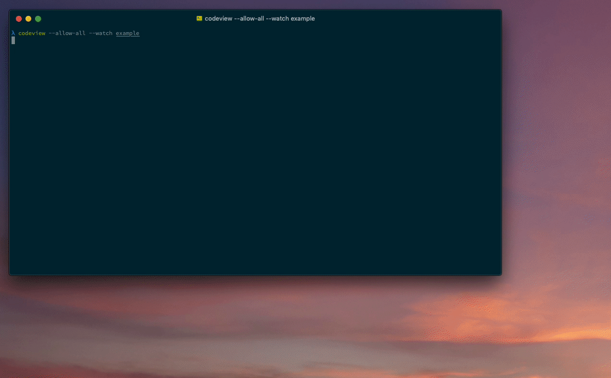

<h1 align="center">❯ Codeview</h1>

<p align="center" class="badges-container">
  <a href="https://github.com/c4spar/deno-codeview/releases">
    
  </a>
  <a href="https://github.com/c4spar/deno-codeview/issues">
    
  </a>
  <a href="https://deno.land/">
    
  </a>
  <a href="https://github.com/c4spar/deno-codeview/blob/main/LICENSE">
    
  </a>
  <br>
  <a href="https://deno.land/x/codeview">
    
  </a>
  <a href="https://nest.land/package/codeview">
    
  </a>
</p>

<p align="center">
  <b>Deno Coverage Webview Reporter</b></br>
  <small>Serve generated code coverage reports in a webview with live reloading.</small>
</p>

<p align="center">
  
</p>

## Requirements

Currently, a local installation of
[genhtml](https://linux.die.net/man/1/genhtml) is required.

**MacOS**

```
brew install lcov
```

**Debian/Ubuntu**

```
sudo apt update
sudo apt install lcov
```

## Permissions

- **--allow-all**: To run test's, coverage, genhtml and the webview and to pass
  all the permission flags to `deno test` which are required by your test's.
- **--unstable**: Required for coverage.

## Installation

```
deno install --allow-all --unstable https://deno.land/x/codeview@0.2.0/codeview.ts
```

## Usage

The `codeview` command works the same way as `deno test` and includes also some
options from `deno coverage`. To start codeview just call:

```
codeview
```

The first argument is the path to the test files/directory (default: `.`) and
the second the path to the watch files/directory (defaults to test files). The
port of the web server can be changed with `--port` (default: `1717`) and the
watch mode can be enabled with `--watch`.

```
codeview path/to/test/files --watch --port 8080
```

For all available options type `codeview help`.
